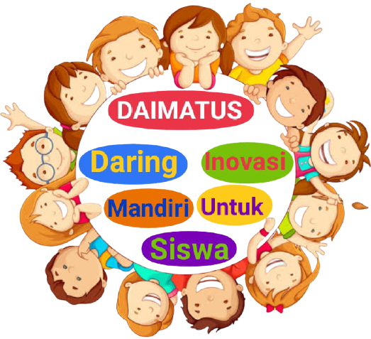

# daimatus

## Introduction

> This is a fullstack web used as online learning platform for fourth grade student. This web has client side for student to watch learning materials and do quiz. The admin web for teacher used for customize learning materials and quizzes. This web built using php native, html, css, and js.

## Demo
Check out the working live demo [here](https://daimatus.000webhostapp.com/)

## Web Screenshoot

## Mobile Screenshoot
The client site for students is compatible with mobile devices of all sizes.
<table>
    <tr>
        <td valign="top"></td>
        <td valign="top"></td>
        <td valign="top"></td>
    </tr>
    <tr>
        <td valign="top"></td>
        <td valign="top"></td>
        <td valign="top"></td>
    </tr>
</table>

## Technologies 
* PHP 8.0.3
* HTML 5
* CSS
* JS
* MySQL
* Font Awesome 4.7.0
* Bootstrap 5.0
* JQuery 3.5.1
* SweetAlert 2

## Setup
Run this project using locally xampp:

* Open xampp, start apache and mysql and then open phpmyadmin 
* Clone or download daimatus and move it to htdocs directory on xampp
* On phpmyadmin create new database and name it daimatus
* Klik import and choose file daimatus.sql from daimatus website in htdocs directory
* Open browser and go to link localhost/daimatus
* To open admin web got to localhost/daimatus/admin and login with username : daimatus-admin and password : daimatus-admin

## Features
Client site :
* Watch video materials
* Do quiz and submit it

Admin site :
* Customizing materials including topic, sub topic, materials picture, and materials video 
* Customizing quizzes per materials
* Configure admin user

## License
This project is licensed under the terms of the [MIT license](https://github.com/erwintobing15/daimatus/blob/main/LICENSE).

